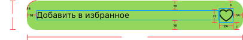

#  Задача 10 | Детали спецпредложения – UI кнопки избранного

[⬅️ назад](../README.md)

## ТЗ

Необходимо реализовать UI элемента "Добавить в избранное" на экране деталей оффера.

### Макет

Иконка сердца:
* small_black_heart.xml – не в избранном (состояние передается в публичном методе setIsFavoriteStatus(isFavorite: Boolean))
* small_black_fill_heart.xml – в избранном (состояние передается в публичном методе setIsFavoriteStatus(isFavorite: Boolean))

**Формат текста**

"Добавить в избранное"
* Шрифт: SfPro 
* Вес: Regular
* Размер: 14sp
* fontResName: [sfpro_regular.ttf](..%2Fsolution%2Fsrc%2Fmain%2Fres%2Ffont%2Fsfpro_regular.ttf)
* includeFontPadding: false

### Эталон

В состоянии "не в избранном"

В состоянии "в избранном"

## Рекомендации
Для перевода `dp` или `sp` в `px` значения используйте методы из файла UnitConverter.kt, который также лежит в модуле solution

## Ограничения
Из класса `AddToFavoriteView` нельзя удалять/менять метод: setIsFavoriteStatus(isFavorite: Boolean), т.к этот метод используется другими классами

## Ожидаемое решение

Необходимо реализовать `AddToFavoriteView` в соответствии с макетом,
в том числе реализовать логику внутри публичных методов согласно их описанию (в javaDocs в коде)

(в своей реализации вы можете на свое усмотрение выбрать класс от которого будет наследоваться AddToFavoriteView,
в эталонном решении использовался LinearLayout)
