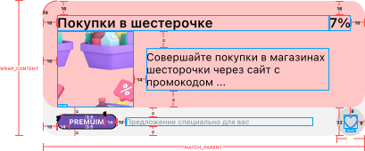

#  Задача 7 | Элемент списока спецпредложений – UI

[⬅️ назад](../README.md)

## ТЗ

Необходимо реализовать UI элемента списка офферов (спецпредложений).

### Макет

**Иконка сердца:**
* small_gray_heart.xml – не в избранном (состояние передается в публичном методе setLikeButtonIconStatus(isFavorite: Boolean))
* small_red_fill_heart.xml – в избранном (состояние передается в публичном методе setLikeButtonIconStatus(isFavorite: Boolean))

Background иконки: R.drawable.like_button_bg

**Изображение:**
* Размер: 86dp на 86dp

**Формат текста**

"Покупки..." + "7%"
* Шрифт: SpPro
* Вес: Semibold
* Размер: 15sp
* fontResName: [sfpro_semibold.ttf](..%2Fsolution%2Fsrc%2Fmain%2Fres%2Ffont%2Fsfpro_semibold.ttf)
* includeFontPadding = false

"Совершайте покупки.."
* Шрифт: SpPro
* Вес: Regular
* Размер: 12sp
* fontResName: [sfpro_regular.ttf](..%2Fsolution%2Fsrc%2Fmain%2Fres%2Ffont%2Fsfpro_regular.ttf)
* includeFontPadding = true

"PREMIUM"
* Шрифт: SpPro
* Вес: Bold
* Размер: 8sp
* fontResName: [sfpro_bold.ttf](..%2Fsolution%2Fsrc%2Fmain%2Fres%2Ffont%2Fsfpro_bold.ttf)
* Цвет: #FFFFFF
* includeFontPadding = true
* paddings: top,bottom = 3.5dp left,right = 14dp
* bgCornerRadius = 7dp
* borderWidth = 1dp

"Предложение специально.."
* Шрифт: SpPro
* Вес: Medium
* Размер: 8sp
* fontResName: [sfpro_medium.ttf](..%2Fsolution%2Fsrc%2Fmain%2Fres%2Ffont%2Fsfpro_medium.ttf)
* Цвет: #9A9A9A
* includeFontPadding = true
* stringRes = R.string.offer_view_bundle_hint

### Эталон

Оффер с подпиской

Оффер без подписки

Оффер в избранном

### Рекомендации
Для перевода `dp` или `sp` в `px` значения используйте методы из файла UnitConverter.kt, который также лежит в модуле solution 

## Ограничения

Из класса `OfferView` нельзя удалять/менять сигнатуру методов: 
 - setOfferName(name: String), 
 - setOfferDescription(description: String), 
 - setCashBackValue(cashBackValue: String), 
 - setBackgroundColor(colorHex: String),
 - setImage(imageResId: Int)
 - setBundle(bundleName: String, bgColorHex: String, borderColorHex: String)
 - setLikeButtonIconStatus(isFavorite: Boolean)
 - setLikeButtonClickListener(onClick: () -> Unit)

т.к эти методы используется другими классами

## Ожидаемое решение

Необходимо реализовать `OfferView` в соответствии с макетом, 
в том числе реализовать логику внутри публичных методов согласно их описанию (в javaDocs в коде)

(в своей реализации вы можете на свое усмотрение выбрать класс от которого будет наследоваться OfferView,
в эталонном решении в качестве основного контейнера использовался LinearLayout)
