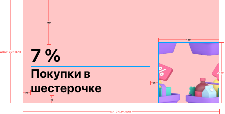

#  Задача 8 | Детали спецпредложения – UI шапки

[⬅️ назад](../README.md)

## ТЗ

Необходимо реализовать UI хэдера экрана деталей офферов.

### Макет

**Формат текста**

"7%"
* Шрифт: SfPro
* Вес: Bold
* Размер: 36sp
* includeFontPadding: true
* fontResName: [sfpro_bold.ttf](..%2Fsolution%2Fsrc%2Fmain%2Fres%2Ffont%2Fsfpro_bold.ttf)

"Покупки..."
* Шрифт: SfPro
* Вес: Bold
* Размер: 24sp
* includeFontPadding: true
* fontResName: [sfpro_bold.ttf](..%2Fsolution%2Fsrc%2Fmain%2Fres%2Ffont%2Fsfpro_bold.ttf)

### Эталон

### Рекомендации

Для перевода `dp` или `sp` в `px` значения используйте методы из файла UnitConverter.kt, который также лежит в модуле solution

## Ограничения

Из класса `OfferInfoHeaderView` нельзя удалять/менять методы: setCashBackValue(cashBackValue: String), setCashBackName(cashBackName: String), setImage(imageResId: Int), setBackgroundColor(colorHex: String), 
т.к эти методы используется другими классами

## Ожидаемое решение

Необходимо реализовать `OfferInfoHeaderView` в соответствии с макетом,
в том числе реализовать логику внутри публичных методов согласно их описанию (в javaDocs в коде)

(в своей реализации вы можете на свое усмотрение выбрать класс от которого будет наследоваться OfferInfoHeaderView,
в эталонном решении в качестве основного контейнера использовался LinearLayout)
