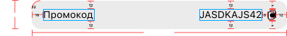

#  Задача 9 | Детали спецпредложения – UI секции промокода

[⬅️ назад](../README.md)

## ТЗ

Необходимо реализовать UI элемента "Промокод" на экране деталей оффера.

### Макет

**Иконка**

* iconResName: drawable/copy_icon.xml

**Формат текста**

"Промокод"
* Шрифт: SfPro
* Вес: Regular
* Размер: 14sp
* includeFontPadding: false
* fontResName: [sfpro_regular.ttf](..%2Fsolution%2Fsrc%2Fmain%2Fres%2Ffont%2Fsfpro_regular.ttf)

"JASDKAJS42"
* Шрифт: SfPro
* Вес: Regular
* Размер: 14sp
* includeFontPadding: false
* fontResName: [sfpro_regular.ttf](..%2Fsolution%2Fsrc%2Fmain%2Fres%2Ffont%2Fsfpro_regular.ttf)

### Эталон

### Рекомендации
Для перевода `dp` или `sp` в `px` значения используйте методы из файла UnitConverter.kt, который также лежит в модуле solution

## Ограничения
Из класса `PromoCodeView` нельзя удалять/менять метод: setPromoCodeValue(value: String), т.к этот метод используется другими классами

## Ожидаемое решение

Необходимо реализовать `PromoCodeView` в соответствии с макетом,
в том числе реализовать логику внутри публичных методов согласно их описанию (в javaDocs в коде)

(в своей реализации вы можете на свое усмотрение выбрать класс от которого будет наследоваться PromoCodeView, 
в эталонном решении использовался LinearLayout)
